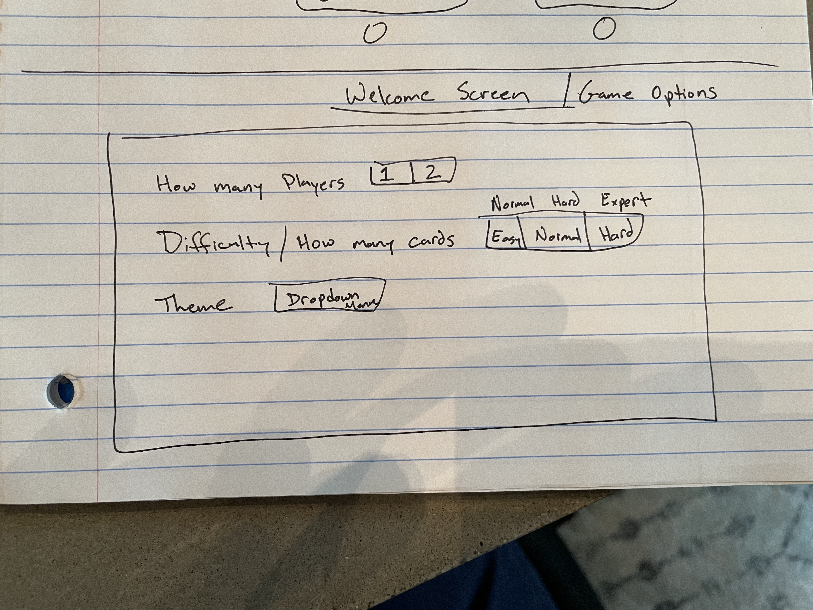

# Project_1
Game Description:
    Player/players pick from a selection of cards, trying to find two that are the same. When two cards match, they are removed from the game board. The goal is to match all the cards or match more cards than your opponent if you are playing two player mode. 

Planning
    My plan is to begin by styling the HTML and CSS, including creating the divs for the cards to live in. After that I will begin coding the Javascript. I plan on using one or more API's to access different sets of cards. I will then set the game conditions within each div based on the user selections.

Tech Used
    HTML, CSS, JavaScript, APIs

As a user, I want to......
    Select a difficultly level (how many cards).
    Select whether it is one player or two players.
    Have a theme (Sports, Flowers, Animals). Maybe have more specific themes like NFL teams, NBA teams, etc. 
    Have a fun image on the back of the card.
    Keep track of whose turn it is.
    Click on two cards to see if they match.
    If the cards do not match, flip them back over after a certain amount of time.(Perhaps have different levels of how quickly they turn back over.)
    Keep track of the cards that match.
    Remove the cards after they match.
    Announce who won the game.
    Keep track of games won.
    Have Start New Game button that allows you to play again with the same settings.
    Have a return to game options button

    Wireframes

    
    
    